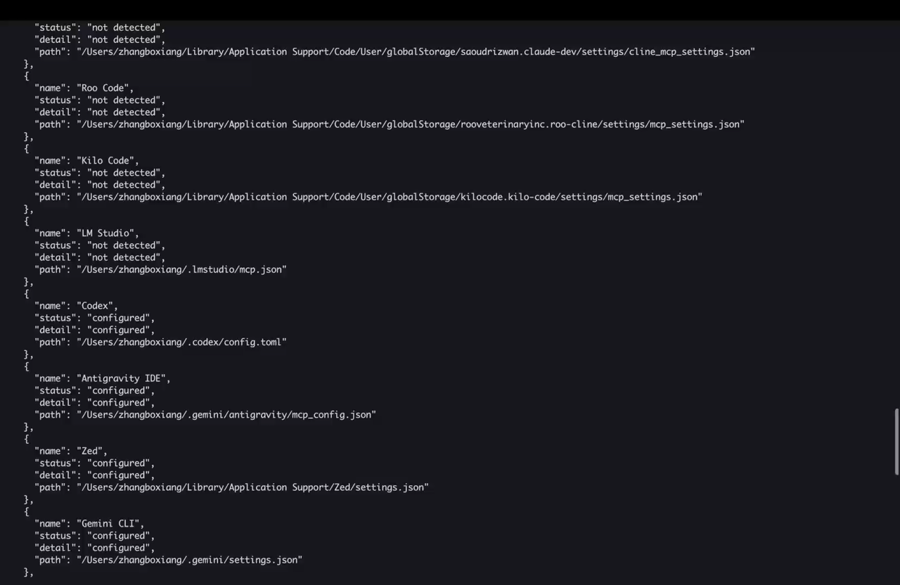
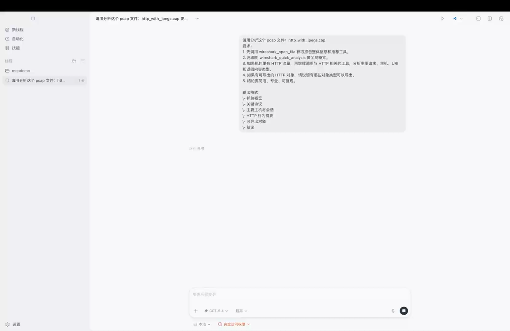

<div align="center">
<!-- mcp-name: io.github.bx33661/wireshark-mcp -->

<br>


<h1>Wireshark MCP</h1>

<p><strong>Give your AI assistant a packet analyzer.</strong><br>
Drop a <code>.pcap</code> file, ask questions in plain English — get answers backed by real <code>tshark</code> data.</p>

<p>
  <a href="https://github.com/bx33661/Wireshark-MCP/actions/workflows/ci.yml">
    
  </a>
  <a href="https://github.com/bx33661/Wireshark-MCP/releases/latest">
    
  </a>
  <a href="https://pypi.org/project/wireshark-mcp/">
    
  </a>
  <a href="https://pypi.org/project/wireshark-mcp/">
    
  </a>
  <a href="LICENSE">
    
  </a>
</p>

<p>
  <a href="README.md">English</a> ·
  <a href="README_zh.md">中文</a> ·
  <a href="CHANGELOG.md">Changelog</a> ·
  <a href="CONTRIBUTING.md">Contributing</a>
</p>

<br>

</div>

---

## What is this?

Wireshark MCP is an [MCP Server](https://modelcontextprotocol.io/introduction) that turns `tshark` into a structured analysis interface, then layers in optional Wireshark suite utilities such as `capinfos`, `mergecap`, `editcap`, `dumpcap`, and `text2pcap` when they are available. The result is a packet-analysis server that still works with only `tshark`, but gets stronger automatically on hosts with more of the Wireshark toolchain installed.

```
You:    "Find all DNS queries going to suspicious domains in this capture."
Claude: [calls wireshark_extract_dns_queries → wireshark_check_threats]
        "Found 3 queries to domains flagged by URLhaus: ..."
```

---

## Prerequisites

- **Python 3.10+**
- **Wireshark** installed with `tshark`
- `tshark` is the only required Wireshark CLI dependency
- Optional suite tools such as `capinfos`, `mergecap`, `editcap`, `dumpcap`, and `text2pcap` are auto-detected and enable extra MCP features when present
- Live capture prefers `dumpcap` when available, but falls back to `tshark` so a minimal installation still works
- `tshark` on your `PATH` is recommended, but `wireshark-mcp install` also records detected absolute Wireshark tool paths for GUI clients
- Any [MCP-compatible client](https://modelcontextprotocol.io/clients): Claude Desktop, Claude Code, Cursor, VS Code, etc.

---

## 1.0 Support Matrix

For `v1.0`, "stable" means the project commits to the following baseline:

| Area | v1.0 baseline |
|---|---|
| Operating systems | Windows, Linux, and macOS |
| CI validation | Test suite runs on all three platforms; packaged CLI smoke tests run on all three platforms; real `tshark` integration smoke runs on Linux |
| Python versions | 3.10, 3.11, 3.12, 3.13 |
| Required Wireshark dependency | `tshark` |
| Optional Wireshark suite tools | `capinfos`, `mergecap`, `editcap`, `dumpcap`, `text2pcap` auto-detected when present |
| Supported install paths | `pip install wireshark-mcp`, source install, and manual MCP config snippets |
| User-facing verification | `wireshark-mcp doctor`, `wireshark-mcp clients`, and `wireshark-mcp config` |

If one of these baseline items stops working, that is a `1.0.x` bug, not a "future enhancement".

---

## Demo Videos

### Install Demo

[](docs/install.mp4)

[Play or download the install demo video](docs/install.mp4)

### Analysis Demo

[](docs/run.mp4)

[Play or download the analysis demo video](docs/run.mp4)

---

## Installation

### Option 1 — One-click install in Cursor (no pre-install needed)

[](cursor://anysphere.cursor-deeplink/mcp/install?name=wireshark-mcp&config=eyJjb21tYW5kIjoidXZ4IiwiYXJncyI6WyJ3aXJlc2hhcmstbWNwIl19)

Requires [uv](https://docs.astral.sh/uv/getting-started/installation/) and [Wireshark](https://www.wireshark.org/) to be installed on your system.

### Option 2 — pip install + auto-configure

```sh
pip install wireshark-mcp
```

Then auto-configure **all** your MCP clients in one command:

```sh
wireshark-mcp install
```

That's it — restart your AI client and you're ready to go. 🎉

If anything still looks off, run:

```sh
wireshark-mcp doctor
```

> **What does `install` do?** It scans your system for known MCP client config files (Claude, Cursor, VS Code, etc.) and injects the `wireshark-mcp` server entry. Existing settings are preserved. See [Supported Clients](#supported-clients) for the full list.

<details>
<summary>Install from source</summary>

```sh
pip install git+https://github.com/bx33661/Wireshark-MCP.git
wireshark-mcp install
```

</details>

<details>
<summary>Uninstall from all clients</summary>

```sh
wireshark-mcp uninstall
```

</details>

---

## Platform Setup

Use this section when you want the shortest reliable path to a working setup on each OS.

<details>
<summary><b>macOS</b></summary>

1. Install Python 3.10+.
2. Install Wireshark and make sure the `tshark` CLI is available.
3. Install the package:

```sh
pip install wireshark-mcp
wireshark-mcp install
wireshark-mcp doctor
```

If you plan to use live capture, `dumpcap` is preferred when available.

</details>

<details>
<summary><b>Linux</b></summary>

1. Install Python 3.10+.
2. Install Wireshark or the distro package that provides `tshark`.
3. Install the package:

```sh
pip install wireshark-mcp
wireshark-mcp install
wireshark-mcp doctor
```

Live capture may require extra capture permissions depending on your distro. Offline `.pcap` analysis works as soon as `tshark` is available.

</details>

<details>
<summary><b>Windows</b></summary>

1. Install Python 3.10+.
2. Install Wireshark and keep the `TShark` component enabled in the installer.
3. In PowerShell or Command Prompt, run:

```powershell
py -m pip install wireshark-mcp
wireshark-mcp install
wireshark-mcp doctor
```

The installer writes absolute Python and Wireshark tool paths for GUI MCP clients, which is especially helpful on Windows where GUI apps often do not inherit your shell environment.

</details>

---

## Supported Clients

`wireshark-mcp install` auto-configures the following clients across macOS, Linux, and Windows:

| Client | Config File |
|--------|------------|
| **Claude Desktop** | `claude_desktop_config.json` |
| **Claude Code** | `~/.claude.json` |
| **Cursor** | `~/.cursor/mcp.json` |
| **VS Code** | `settings.json` (via `mcp.servers`) |
| **VS Code Insiders** | `settings.json` (via `mcp.servers`) |
| **Windsurf** | `mcp_config.json` |
| **Cline** | `cline_mcp_settings.json` |
| **Roo Code** | `mcp_settings.json` |
| **Kilo Code** | `mcp_settings.json` |
| **Antigravity IDE** | `mcp_config.json` |
| **Zed** | `settings.json` (via `mcp.servers`) |
| **LM Studio** | `mcp.json` |
| **Warp** | `mcp_config.json` |
| **Trae** | `mcp_config.json` |
| **Gemini CLI** | `settings.json` |
| **Copilot CLI** | `mcp-config.json` |
| **Amazon Q** | `mcp_config.json` |
| **Codex** | `config.toml` |

For unsupported clients, run `wireshark-mcp config` to get the JSON snippet and paste it manually.

---

## Configuration

### Recommended: Auto-Configuration (one command)

```sh
pip install wireshark-mcp
wireshark-mcp install
```

This detects all installed MCP clients and writes the config automatically. Existing settings are preserved.
The generated entry always uses the current Python interpreter (`python -u -m wireshark_mcp.server`), forwards your current `PATH`, and stores detected absolute Wireshark tool paths when available, so GUI MCP clients do not need `wireshark-mcp` or `tshark` to be discoverable on their own.

> ⚠️ **Restart your MCP client** after running `install` for changes to take effect.
> 🔎 If analysis tools still fail to launch, run `wireshark-mcp doctor` to verify Python, required vs optional Wireshark CLI tools, and client config detection.

### Manual Configuration

If you prefer to configure manually, start with:

```sh
wireshark-mcp config
```

If you use Codex:

```sh
wireshark-mcp config --format codex-toml
```

Detailed client-by-client instructions now live in [docs/manual-configuration.md](docs/manual-configuration.md), including Claude Desktop, Claude Code, Cursor, VS Code, Codex, generic JSON-based clients, and Docker / SSE mode.

---

## 5-Minute Verification

After installation, this is the fastest way to confirm the setup is actually production-usable:

1. Check the package entrypoint:

```sh
wireshark-mcp --version
```

2. Verify Python and Wireshark tool discovery:

```sh
wireshark-mcp doctor
```

Automation-friendly form:

```sh
wireshark-mcp doctor --format json
```

3. Confirm your client targets were detected:

```sh
wireshark-mcp clients
```

Automation-friendly form:

```sh
wireshark-mcp clients --format json
```

4. Print the exact manual config for the current machine:

```sh
wireshark-mcp config
```

If you use Codex specifically, you can also render TOML directly:

```sh
wireshark-mcp config --format codex-toml
```

5. Open your MCP client, attach a small `.pcap`, and run:

```text
Use wireshark_open_file on this capture, summarize the protocols you see, then run wireshark_quick_analysis.
```

If all five checks work, the install is in the expected `v1.0` steady state.

---

## Operational Docs

Detailed steady-state and release docs now live under `docs/`:

- [Platform validation](docs/platform-validation.md)
- [Release checklist](docs/release-checklist.md)
- [Manual configuration](docs/manual-configuration.md)
- [Prompt engineering](docs/prompt-engineering.md)

---

## Quick Start

Paste this into your AI client after pointing it at a pcap file:

```
Analyze <path/to/file.pcap> using the Wireshark MCP tools.

- Start with wireshark_open_file to get capture-wide context and recommended tools.
- Use wireshark_security_audit for a one-call security analysis.
- Or use wireshark_quick_analysis for a fast traffic overview.
- Drill into details with wireshark_follow_stream or wireshark_get_packet_details.
- Never guess — always verify with tools.
- Write findings to report.md.
```

---

## Bundled Codex Skill

This repo also includes a Codex skill at `skills/wireshark-traffic-analysis/`.
It is designed for disciplined packet analysis: start with capture-wide context, choose the right workflow, validate with packet evidence, and finish with actionable next steps.
The latest revision is also grounded in official Wireshark documentation for protocol hierarchy, endpoints, conversations, expert info, display filters, and stream-follow behavior.
For cross-app discovery, the same skill is mirrored into `.github/skills/` and `.claude/skills/`, with root instruction files (`AGENTS.md`, `CLAUDE.md`, `GEMINI.md`), GitHub Copilot instructions, and a machine-readable catalog at `skills/manifest.json`.

The skill supports these modes:

- `triage`
- `security`
- `incident-response`
- `troubleshoot`
- `ctf`

Example invocation:

```text
Use $wireshark-traffic-analysis to investigate <file.pcap>.
Start in triage mode, escalate if you find suspicious behavior, and produce a concise report with exact filters, streams, frames, confidence, and next steps.
```

---

## Compatibility Policy

- The stable CLI for `1.x` is the subcommand interface: `serve`, `install`, `uninstall`, `doctor`, `config`, `clients`.
- Legacy flags such as `--install`, `--doctor`, and `--config` remain supported throughout `1.x`.
- `wireshark_read_packets` remains available throughout `1.x` for backwards compatibility, but it is deprecated and not recommended for new workflows.
- New packet-inspection workflows should use `wireshark_get_packet_list` and `wireshark_get_packet_details`.

---

## Prompt Engineering

LLMs perform best when you tell them to:

- start with `wireshark_open_file`
- use agentic tools first, then drill down
- verify instead of guessing
- produce a structured report

Ready-to-paste prompt templates for security audits, CTF work, and performance troubleshooting now live in [docs/prompt-engineering.md](docs/prompt-engineering.md).

## Tools

<details>
<summary><b>⚡ Agentic Workflows</b> — one-call comprehensive analysis</summary>

<br>

| Tool | Description |
|---|---|
| `wireshark_security_audit` | **One-call security audit**: 8-phase analysis (threat intel, credential scan, port scan, DNS tunnel, cleartext, anomalies) with risk scoring (0-100) and recommendations |
| `wireshark_quick_analysis` | **One-call traffic overview**: file info, protocol distribution, top talkers, conversations, hostnames, anomaly summary, suggested next steps |
| `wireshark_open_file` | **Smart file opener**: analyzes pcap content and recommends the most relevant tools while keeping the MCP tool surface stable |
| `wireshark_get_capabilities` | **Toolchain capability report**: required, recommended, and optional Wireshark suite tools visible to the current MCP server |

> 💡 These tools replace the need to manually chain 5-10 tool calls. Just call one and get a complete report.

</details>

<details>
<summary><b>Packet Analysis</b> — inspect, navigate, and search packets</summary>

<br>

| Tool | Description |
|---|---|
| `wireshark_get_packet_list` | Paginated packet list with display filter and custom column support |
| `wireshark_get_packet_details` | Full JSON dissection of a single frame, with optional layer filtering to cut token usage |
| `wireshark_get_packet_bytes` | Raw Hex + ASCII dump (Wireshark's "Packet Bytes" pane) |
| `wireshark_get_packet_context` | View N packets before and after a frame for contextual debugging |
| `wireshark_read_packets` | Deprecated compatibility tool retained for `1.x`; prefer `wireshark_get_packet_list` and `wireshark_get_packet_details` |
| `wireshark_follow_stream` | Reassemble a full TCP / UDP / HTTP stream with pagination and search |
| `wireshark_search_packets` | Pattern search across raw bytes or decoded fields (Regex supported) |

</details>

<details>
<summary><b>Data Extraction</b> — pull structured data from captures</summary>

<br>

| Tool | Description |
|---|---|
| `wireshark_extract_fields` | Extract any tshark fields as a table |
| `wireshark_extract_http_requests` | HTTP method, URI, and host for every request |
| `wireshark_extract_dns_queries` | All DNS queries in the capture |
| `wireshark_list_ips` | All unique source, destination, or both IP addresses |
| `wireshark_export_objects` | Extract embedded files (HTTP, SMB, TFTP, etc.) |
| `wireshark_verify_ssl_decryption` | Confirm TLS decryption using a keylog file |

</details>

<details>
<summary><b>Statistics</b> — traffic patterns and anomaly detection</summary>

<br>

| Tool | Description |
|---|---|
| `wireshark_stats_protocol_hierarchy` | Protocol Hierarchy Statistics — see what protocols dominate |
| `wireshark_stats_endpoints` | All endpoints sorted by traffic volume |
| `wireshark_stats_conversations` | Communication pairs with byte/packet counts |
| `wireshark_stats_io_graph` | Traffic volume over time (spot DDoS, scans, bursts) |
| `wireshark_stats_expert_info` | Wireshark's expert analysis: errors, warnings, notes |
| `wireshark_stats_service_response_time` | SRT stats for HTTP, DNS, and other protocols |

</details>

<details>
<summary><b>File Operations & Live Capture</b></summary>

<br>

| Tool | Description |
|---|---|
| `wireshark_get_file_info` | File metadata via `capinfos` (duration, packet count, link type) |
| `wireshark_merge_pcaps` | Merge multiple captures into one file |
| `wireshark_filter_save` | Apply a display filter and save matching packets to a new file |
| `wireshark_list_interfaces` | List available network interfaces |
| `wireshark_capture` | Start a live capture (duration, packet count, BPF filter, ring buffer) |

</details>

<details>
<summary><b>Suite Utilities</b> — optional Wireshark companion tools</summary>

<br>

These tools are additive. The server still starts with only `tshark`, and only advertises or uses the extra workflows below when the corresponding Wireshark companion binaries are present.

| Tool | Description |
|---|---|
| `wireshark_editcap_trim` | Trim a capture to a timestamp window using `editcap` |
| `wireshark_editcap_split` | Split a capture by packet count or interval using `editcap` |
| `wireshark_editcap_time_shift` | Shift packet timestamps by a relative offset using `editcap` |
| `wireshark_editcap_deduplicate` | Remove duplicate packets using `editcap`'s duplicate window |
| `wireshark_text2pcap_import` | Convert ASCII or hex dumps into capture files using `text2pcap` |

</details>

<details>
<summary><b>Security Analysis</b></summary>

<br>

| Tool | Description |
|---|---|
| `wireshark_check_threats` | Cross-reference captured URLs and hostnames against [URLhaus](https://urlhaus.abuse.ch/) threat intelligence |
| `wireshark_extract_credentials` | Detect plaintext credentials in HTTP Basic Auth, FTP, and Telnet |
| `wireshark_detect_port_scan` | Detect SYN, FIN, NULL, and Xmas port scans with configurable threshold |
| `wireshark_detect_dns_tunnel` | Detect DNS tunneling (long queries, TXT abuse, subdomain entropy) |
| `wireshark_detect_dos_attack` | Detect DoS/DDoS patterns (SYN flood, ICMP/UDP flood, DNS amplification) |
| `wireshark_analyze_suspicious_traffic` | Comprehensive anomaly analysis: cleartext protocols, unusual ports, expert warnings |

</details>

<details>
<summary><b>Protocol Deep Dive</b> — TLS, TCP, ARP, SMTP, DHCP analysis</summary>

<br>

| Tool | Description |
|---|---|
| `wireshark_extract_tls_handshakes` | TLS version, cipher suite, SNI, and certificate info from Client/Server Hello |
| `wireshark_analyze_tcp_health` | TCP retransmissions, duplicate ACKs, zero window, resets, out-of-order analysis |
| `wireshark_detect_arp_spoofing` | ARP spoofing detection: IP-MAC conflicts, gratuitous ARP floods |
| `wireshark_extract_smtp_emails` | SMTP email metadata: sender, recipient, mail server info |
| `wireshark_extract_dhcp_info` | DHCP lease information: assigned IPs, hostnames, DNS servers |

</details>

<details>
<summary><b>Decoding & Visualization</b></summary>

<br>

| Tool | Description |
|---|---|
| `wireshark_decode_payload` | Auto-detect and decode Base64, Hex, URL encoding, Gzip, Deflate, Rot13, and more |
| `wireshark_plot_traffic` | ASCII bar chart of traffic over time — spot DDoS or scan patterns instantly |
| `wireshark_plot_protocols` | ASCII protocol tree — visual overview of what's in the capture |

</details>

> **Note**: Security, Protocol, and Threat tools stay available for the whole session. `wireshark_open_file` recommends which ones are most relevant for the current capture.

---

## MCP Resources

| Resource URI | Description |
|---|---|
| `wireshark://reference/display-filters` | Complete display filter syntax cheatsheet with common examples |
| `wireshark://reference/protocol-fields` | Protocol field name reference for filters and extraction |
| `wireshark://guide/usage` | Recommended analysis workflows and tips |
| `wireshark://capabilities` | Current required, recommended, and optional Wireshark suite capabilities |

## MCP Prompts

| Prompt | Description |
|---|---|
| `security_audit` | Full security audit workflow: threat intel, credential scan, attack detection |
| `performance_analysis` | Network performance analysis: TCP health, response times, bottlenecks |
| `ctf_solve` | CTF challenge solver: flag search, stream analysis, steganography checks |
| `incident_response` | IR workflow: triage, IOC extraction, attack timeline, containment |
| `traffic_overview` | Quick traffic summary with protocol breakdown and visualization |
## Why Wireshark MCP?

There are other network analysis MCP servers out there, but Wireshark MCP was built with a few core goals:

| Feature | Wireshark MCP | Others |
|---------|:---:|:---:|
| One-command install (`install`) | ✅ | ❌ |
| Agentic workflows (one-call security audit) | ✅ | ❌ |
| Capture-aware recommendations with stable tool surface | ✅ | ❌ |
| 40+ specialized analysis tools | ✅ | 5-10 |
| Threat intelligence integration | ✅ | ❌ |
| Smart Python env detection | ✅ | ❌ |
| 18+ MCP client support | ✅ | Manual |

---

## Troubleshooting

| Symptom | What it usually means | What to do |
|---|---|---|
| `tshark` is missing in `doctor` | Wireshark or the CLI component is not installed, or the path is not discoverable | Install Wireshark with `tshark`, then rerun `wireshark-mcp doctor` |
| MCP client sees the server but tool calls fail to launch | The GUI client is missing runtime env vars or absolute tool paths | Rerun `wireshark-mcp install`, restart the client, then rerun `wireshark-mcp doctor` |
| Live capture fails but offline `.pcap` analysis works | Capture permissions or `dumpcap` availability are the issue, not the core server | Use offline capture files first; if you need live capture, grant the required OS-specific capture permissions |
| `capinfos`, `editcap`, or `text2pcap` are missing | Optional Wireshark suite tools are not installed | This is not fatal; the server still works with `tshark`, but those extra workflows stay unavailable |
| Your client is not in the supported list | Auto-install only covers known config formats | Run `wireshark-mcp config` or `wireshark-mcp config --format codex-toml` and paste the output manually |

---

## Development

**Install dev dependencies:**

```sh
pip install -e ".[dev]"
```

**Test with the MCP Inspector** (opens a local web UI to call tools interactively):

```sh
npx -y @modelcontextprotocol/inspector uv run wireshark-mcp
```

**Run the test suite:**

```sh
uv run python -m pytest tests/ -v
```

**Lint & type check:**

```sh
uv run python -m ruff check src/ tests/
uv run python -m mypy --package wireshark_mcp --ignore-missing-imports --no-namespace-packages
```

**Docker:**

```sh
docker compose up -d
# Pcap files go in ./pcaps/ (mounted as /data)
```

**CLI options:**

```sh
wireshark-mcp                          # Start the stdio MCP server
wireshark-mcp serve --transport sse --host 0.0.0.0 --port 8080
wireshark-mcp install                  # Auto-configure all detected MCP clients
wireshark-mcp install --client codex   # Target a specific client
wireshark-mcp uninstall
wireshark-mcp doctor                   # Human-readable diagnostics
wireshark-mcp doctor --format json     # Machine-readable diagnostics
wireshark-mcp clients                  # Human-readable client detection
wireshark-mcp clients --format json    # Machine-readable client detection
wireshark-mcp config                   # Print JSON config for manual setup
wireshark-mcp config --format codex-toml
wireshark-mcp --version
```

Legacy flags such as `--install`, `--doctor`, and `--config` remain supported for backwards compatibility.

See [CONTRIBUTING.md](CONTRIBUTING.md) for the full development setup guide.

---

<div align="center">
<sub><a href="LICENSE">MIT License</a> · <a href="https://github.com/bx33661/Wireshark-MCP/issues">Report a Bug</a></sub>
</div>
